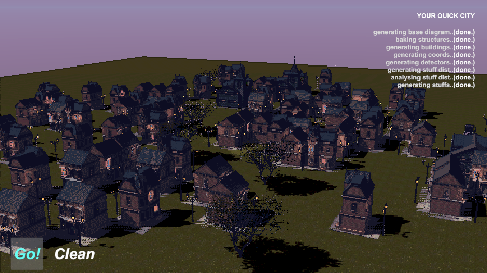

# Your Quick City - 快速城镇地图生成插件

还在为制作场景时需要逐个摆放model而困扰吗? YQC插件提供了一套面向开发者的快速城镇模板和生成算法, 让你能快速在场景中布局心仪的地图.

To view English document, please view: [Google 翻译](https://translate.google.com/)

## 在线演示案例

要运行在线生成演示案例, 请访问: [Unity WebGL Player | YQC (shthemw.github.io)](https://shthemw.github.io/Your-Quick-City.github.io/)

案例中预先定义了一份地图模板, 您可以通过点击底部的"Go"按钮来根据此模板随机生成场景实体. 点击"Clean"按钮以清除当前场景和控制台.